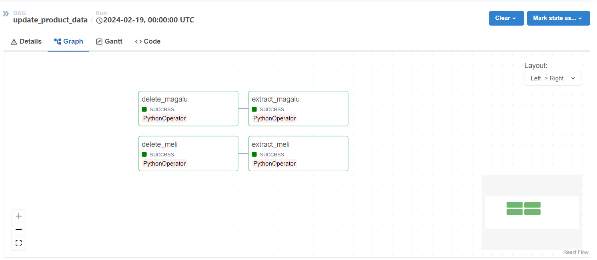

<a href="https://projectx-eight-gilt.vercel.app/">
  <h1 align="center">Price Miner: ETL de Dados de Promoções </h1>
</a>

<p align="center">
  Processo de ETL de dados de ofertas nas Lojas Mercado Livre e Magazine Luiza.
</p>

<p align="center">
  <a href="#">
    
  </a>
</p>

<p align="center">
  <a href="#"><strong>Python</strong></a> ·
  <a href="#"><strong>Apache Airflow</strong></a> ·
  <a href="#"><strong>Django</strong></a> ·
  <a href="#"><strong>API</strong></a> ·
  <a href="#"><strong>Database</strong></a>
</p>
<br/>

## Introdução

Bem-vindo ao Price Miner, um projeto de ETL end-to-end para coletar, processar e disponibilizar ofertas de diversas lojas em um único app.

### Projeto de ETL

**Extração de Dados** - Web Scraping

Para extrair os dados das plataformas digitais, utilizamos a técnica de web scraping (raspagem de dados) para obter as informações das ofertas.

Todo o processo de Extração, Transformação, Carga e Consulta de dados e feito pela API `price-miner-services`

A documentação completa da API pode ser encontrada <a href="https://www.postman.com/interstellar-crescent-948829/workspace/production/collection/22689250-8e6c13d1-c2a2-469d-9365-cfe9b62c59ea?action=share&creator=22689250">aqui</a>.

Exemplo de consulta: 

```
"products": [
      {
          "title": "Product Title",
          "store": "Store",
          "price_current": "103",
          "price_original": "",
          "discount": "26% OFF",
          "product_url": "",
          "img_src": "https://http2.abcde.com/ASDHAKSJHD123123786ds.webp",
          "img_alt": "Product Title",
          "created_at": "2024-02-14"
      },
```


### Projeto de Automação

Para controlar a API e atualizar os dados diariamente utilizamos o airflow para automatizar o workflow de ETL.



### Web Site - price-miner-web (Em Breve)

Website para exibir as ofertas.


## Tech Stack + Features

### Frameworks

- [Django](https://www.djangoproject.com/) – Django The web framework for perfectionists with deadlines.
- [Bootstrap](https://getbootstrap.com/) – A powerful, feature-packed frontend toolkit.

### Platforms

- [Apache Airflow](https://airflow.apache.org/) – Plataforma para agendar e monitorar workflows de ETL.
- [Azure](https://azure.microsoft.com/) – Plataforma de Hospedagem
- [Oracle](https://www.oracle.com/) - Banco de Dados Cloud

### UI

- [Uiverse](https://uiverse.io/) – Open-Source UI elements for any project

## Repo Activity


